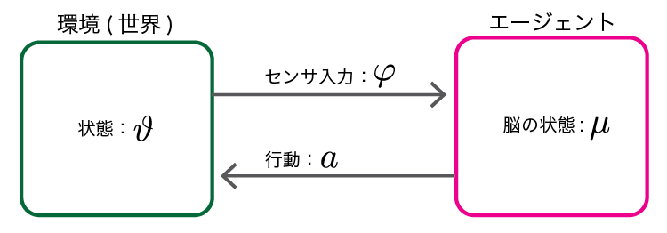
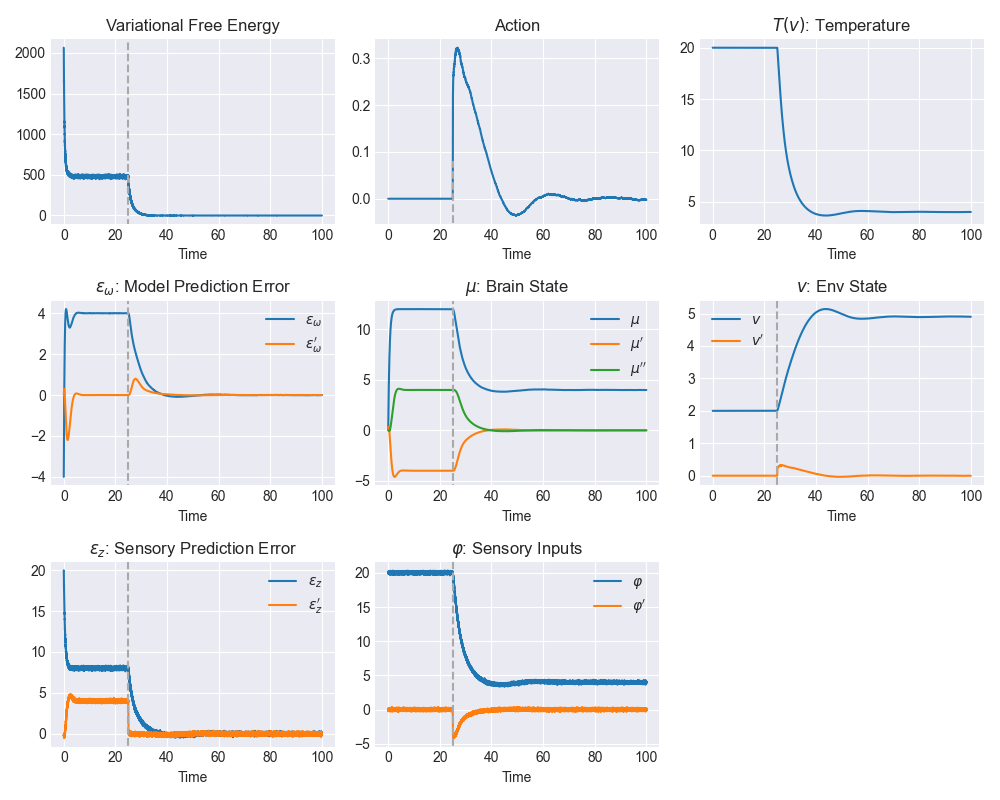

自由エネルギー原理のレビュー論文 [The free energy principle for action and perception: A mathematical review](https://www.sciencedirect.com/science/article/pii/S0022249617300962?via%3Dihub) に従った勉強ノート。

## FEPを理解する

自由エネルギー原理(Free energy principle; FEP)は [Friston](https://www.fil.ion.ucl.ac.uk/~karl/) らのグループによって提唱されている脳の働きに関する原理。
この原理は [吉田ら]() によると

>「いかなる自己組織化されたシステムでも環境内で平衡状態であるためには、そのシステムの（情報的）自由エネルギーを最小化しなくてはならない」という規範的な原理

と説明されている。

FEPのすごいところはその懐の広さで、脳の働きを短い時間の知覚から進化レベルにいたる幅広い時間スパンにおいて説明することができるらしい。さらにこの説明はPredictive codingやBayesian brainなどの他の脳モデルを統一的に扱うこともできる。

だがFEPはその一般性故にとても難解で、オリジナルの論文を読んで理解するのは大変だ。
そのため解説本や論文がいくつか出ている。このノートで参考にしたのは以下の3つ。

- [吉田ら;2018]: 吉田正俊, 田口茂. 2018. “自由エネルギー原理と視覚的意識.” 日本神経回路学会誌 25 (3): 53–70. [link](https://www.jstage.jst.go.jp/article/jnns/25/3/25_53/_article/-char/ja/)
- [乾ら;2020]: 乾 敏郎, 阪口 豊. 2020. "脳の大統一理論: 自由エネルギー原理とはなにか (岩波科学ライブラリー 299)" 岩波書店. [link](https://www.iwanami.co.jp/book/b548871.html)
- [Buckle et al.;2017]: Buckley, Christopher L., Chang Sub Kim, Simon McGregor, and Anil K. Seth. 2017. “The Free Energy Principle for Action and Perception: A Mathematical Review.” Journal of Mathematical Psychology 81: 55–79. [link](https://www.sciencedirect.com/science/article/pii/S0022249617300962)

一番上の著者である吉田先生は[ブログ](http://pooneil.sakura.ne.jp/archives/cat/fep.php)でも細かな解説をしている。

以下は主に[Buckle et al.;2017]の式を追いかける形でFEPの説明をする。
この論文はFEPを数式で理解するためのイントロ論文で、FEPを使った脳の知覚と行動のモデル導出が丁寧に解説されている。
特にシンプルな例におけるモデル数値シミュレーションも紹介されており、理解の助けになる。
論文のAppendixに載っているシミュレーションコードはMATLABだが、私はMATLABを持っていないのでPythonで[実装した](https://gist.github.com/kzmssk/0a26071c1bf71f1007fccaca6c723bc2)。
後半でその実験結果も紹介する。

## 問題設定とFEPの導出

まずは上の図のような問題設定を考える。
環境（世界）にあるエージェントが存在する。
環境は状態\(\vartheta\)を持っており、エージェントはセンサ入力\(\varphi\)を通してのみ環境を観測することができる。
つまり直接\(\vartheta\)を知ることはできない。
エージェントの状態（脳の状態）は\(\mu\)で表す。
また、エージェントは行動を通しても環境に働きかけることができる。
つまり行動\(a\)によって\(\vartheta\)が変化する。

FEPでは**知覚と行動はどちらも推論によりもたらされる**と考える（ヘルムホルツ的世界観）。
よくある、センサ入力を何かしらの関数で処理するようなボトムアップ的手続きのみによる知覚理解とは異なる。

具体的にはエージェントは直接不可知な環境の状態\(\vartheta\)の分布をセンサ入力\(\varphi\)を通じて推論する。
つまり両者の同時分布\(p(\vartheta, \varphi)\)を求める。この分布は **Generative density(G-Density)** と呼ばれる。

ここで具体的なセンサ入力\(\phi\)が与えられたときの事後確率を求めると

$$
p(\vartheta|\phi) = \frac{1}{p(\vartheta=\phi)}p(\phi|\vartheta)p(\vartheta)
$$

周辺化の定義より

$$
\tag{1}p(\vartheta|\phi) = \frac{p(\phi|\vartheta) p(\vartheta)}{\int p(\phi|\vartheta) p(\vartheta) d\vartheta}.
$$

式(1)の分母は計算が困難なので変分ベイズの考え方を使う。
つまり別の\(\vartheta\)の分布\(q(\vartheta)\)を考え、こいつを\(p(\vartheta|\phi)\)に近づけることを考える。両者の擬距離であるKullback-Leibler divergence（KL距離)を最小化する。KL距離は

$$
D_{KL}(q(\vartheta)||p(\vartheta|\phi)) = \int d\vartheta q(\vartheta) \ln \frac{q(\vartheta)}{p(\vartheta|\phi)}
$$

\(q(\vartheta)\)はエージェントが推論する状態の分布を表していることから **Recognition-density(R-density)** と呼ばれる。

\(D_{KL}\)の式を展開して整理する。ベイズの定理を用いて\(p(\vartheta|\phi)\)を同時分布であらわし、代入して整理すると

$$
\int d\vartheta q(\vartheta) \ln \frac{q(\vartheta)}{p(\vartheta|\phi)} = \underbrace{\int d\vartheta q(\vartheta) \ln \frac{q(\vartheta)}{p(\vartheta, \varphi)}}_{F} + \ln p(\varphi)
$$

となる。この式の\(F\)はVariational Free Energy（変分自由エネルギー）と呼ばれる。
この式の2項目は\(\varphi\)に影響を受けないため、\(D_{KL}\)を最小化する過程では無視できる。

つまり自由エネルギー\(F\)を最小化すれば、R-densityがある具体的なセンサ入力を与えられた場合の環境状態の事後確率に近くなり、環境の状態をより知ることができるわけだ。

ちなみに\(F\)をさらに整理すると

$$
\tag{2} F = \int d\vartheta q(\vartheta) E(\vartheta, \varphi) + \int d\vartheta q(\vartheta) \ln q(\vartheta)
$$

ただし\(E \equiv -\ln p(\vartheta, \varphi).\)式(2)の1項目は熱力学における*average energy*、2項目は負のエントロピーに対応している。

## シンプルなモデル

では自由エネルギー\(F\)は脳内で具体的にどのように計算されるのか。
\(F\)を計算するためにはR-density\(q(\vartheta)\)とG-density\(p(\vartheta, \varphi)\)の関数の形を決める必要がある。
論文ではR-densityが複数の関数の集まりと仮定する*ensemble learning*と共に、より扱いやすい仮定として*Laplace approximation*が紹介されている。
これをみてみよう。

論文では脳の状態\(\mu\)とセンサ入力\(\varphi\)がどちらも多変数からなるベクターの場合も扱っているが、ここでは最もシンプルな1変数の場合を説明する。

### R-densityの具体的な導出

R-densityを脳の状態\(\mu\)でパラメタライズされた確率分布\(q(\vartheta; \mu)\)とする。
さらにこの分布が平均\(\mu\)、分散\(\zeta\)からなる単峰ガウス分布であると仮定する。

$$
q(\vartheta) \equiv \frac{1}{Z} \exp(-\varepsilon(\vartheta))
$$

ただし\(Z \equiv \sqrt{2\pi\zeta}\), \(\varepsilon \equiv (\vartheta - \mu)^2 / (2\zeta)\)。
ちなみにこの\(Z\)は統計力学における分配関数に相当するらしい。

(2)式の\(F\)にこいつを代入、整理すると以下のようになる。

$$
\tag{3} F = -\ln Z \underbrace{- \int d\vartheta q(\vartheta) \varepsilon(\vartheta)}_{\text{(イ)}} + \underbrace{\int d\vartheta q(\vartheta) E(\vartheta, \varphi)}_{\text{(ロ)}}
$$

(イ)は\(\varepsilon\)の定義を代入してやるとガウス分布の分散の積分がでてくるため、積分の項が消えて\(-\frac{1}{2}\)になる。

(ロ)では\(E\)が\(\vartheta\)について滑らかであり、平均の周辺でのみ0より大きいとさらに仮定する。
\(E\)を\(\vartheta\)の周りで2次の項までテイラー展開してガウス分布の平均と分散の積分を適用して整理すると

$$
\text{(ロ)} = E(\mu, \varphi) + \frac{1}{2} \Big[ \frac{d^2 E}{d \vartheta^2} \Big] _\mu
$$

\(E(\mu, \varphi) = -\ln p(\varphi, \vartheta)\)は**Laplace-encoded energy**と呼ばれる。
これで\(F\)を\(\mu, \zeta, \varphi\)の関数で表すことができた。

さらに\(F\)を\(\zeta\)で微分すると、

$$
dF = \frac{1}{2} \Big\{ \Big[ \frac{d^2E}{d\vartheta^2} \Big]_\mu - \frac{1}{\zeta} \Big\} d\zeta
$$

\(F\)を最小化したときには\(dF \equiv 0\)であり、このときの\(\zeta\)を\(\zeta^*\)とあらわすと、

$$
\zeta^* = \Big[ \frac{d^2E}{d\vartheta^2} \Big]_\mu^{-1}
$$

肩の\(-1\)はinverse。(3)式へここまでの結果を代入すると

$$
\tag{4} F = E(\mu, \varphi) - \frac{1}{2} \ln \{ 2\pi\zeta^*\}
$$

（4）式の1項目はG-density由来、2項目はR-density由来になっており、これでFを2つのdensityに分解できた。

### G-densityの導出

G-densityもR-densityと同様にガウス分布であると仮定する。
G-densityの形は環境を時事刻々と変化する動的なモデルとするか、一定である静的なモデルとするかで変わってくる。
ここではシミュレーション実験で扱っている動的なモデルをみよう。

FEPにおけるG-densityの動的モデルはGeneralized coordinatesと呼ばれる方法を使っている。Generalized coordinatesでは変数の\(n\)階の微分(\(n=0, 1, 2\cdots\))を全てのダイナミクスをモデリングする。ここでいう微分とは時間微分のことであり、たとえば\(n=1\)であれば速度、\(n=2\)であれば加速度に対応する。これら全てがそれぞれ独立したダイナミクスを持っているような方程式としてセンサ入力\(\varphi\)と脳の状態\(\mu\)のモデルを作る。

まずはセンサ入力\(\varphi\)のダイナミクスを考えよう。つまり

$$
\tilde{\varphi} = (\varphi, \varphi', \varphi'', \cdots) \equiv (\varphi_{[0]}, \varphi_{[1]}, \varphi_{[2]}, \cdots)
$$

を変数としてみる。\( \varphi_{[n]} \)は\(\varphi\)の\(n\)階微分という意味。同様に\(\tilde{\mu}\)も定義しておく。

\(\varphi\)は\(\mu\)に関する関数\(g\)と独立したノイズ\(z\)の和であると仮定する。
ノイズは平均0で固定の分散を持ったガウシアンノイズが想定される。よって\(\tilde{\varphi}\)の振る舞いは\(\tilde{\mu}\)と同様にノイズの微分を並べた\(\tilde{z}\)を使った確率微分方程式

$$
\tilde{\varphi} = \tilde{g} + \tilde{z}
$$

であらわされる。ただし\(\tilde{g}\)は次のように定義される

$$
g_{[n]} \equiv \frac{\partial g}{\partial \mu} \mu_{[n]}
$$

脳の状態\(\mu\)も同様にモデリングを行う。
つまり、こちらもセンサ入力と同様に\(\mu\)に関する関数\(f\)と独立したノイズ\(\omega\)の和と仮定する。すべての項目を1階微分する微分演算子\(D\) (\(\frac{d}{dt}\)と同じ意味)を使って表すと、

$$
D\tilde{\mu} = \tilde{f} + \tilde{\omega}
$$

となる。
ここまで微分のオーダーを決めていなかった。実際に計算する際には無限回微分はできないので\(n_{max}\)で打ち切るわけだが、このとき

$$
\mu_{[n_{max}]} = \omega_{[n_{max}]}
$$

とする。つまり最も高いオーダーの\(\mu\)はノイズであるとする。

ここまでで得られた\(\tilde{\mu}\)と\(\tilde{\varphi}\)を使ってG-densityを求めたい。
同時確率であるG-densityは\(p(\tilde{\varphi}|\tilde{\mu})\)と\(p(\tilde{\mu})\)の積であらわされる。

この2つの形を決めよう。\(p(\tilde{\varphi}|\tilde{\mu})\)は次のように決める:

$$
p(\tilde{\varphi}|\tilde{\mu}) = \prod_{n=0}^{\infty} p(\varphi_{[n]}|\mu_{[n]})
$$

マルコフ性が過程されている。そして各オーダー\(n\)ではR-densityと同様にそれぞれがガウス分布に従うと仮定する。つまり

$$
p(\varphi_{[n]}|\mu_{[n]}) = \frac{1}{\sqrt{ 2 \pi \sigma_{z[n]}}} \exp \Big[ -\frac{ \{ \varphi_{[n]} - g_{[n]} \}^2 }{ 2 \sigma_{z[n]} } \Big]
$$

ここで\(\sigma_{z_{[n]}}\)は\(n\)階におけるガウス分布の分散をあらわしている。

\(p(\tilde{\mu})\)は1つ下の階の\(\mu\)による条件付き分布の積和を使って表現する:

$$
\begin{aligned}
p(\tilde{\mu}) &= \prod_{n=0}^{\infty} p(\mu_{[n+1]} | \mu_{[n]}) \\
p(\mu_{[n+1]} | \mu_{[n]}) &= \frac{1}{\sqrt{ 2 \pi \sigma_{\omega_{[n]}} }} \exp \Big[ -\frac{ \{ \mu_{[n]} - f_{[n]} \}^2   }{ 2 \sigma_{\omega_{[n]}} }  \Big]
\end{aligned}
$$

\(\sigma_{\omega_{[n]}}\)は\(n\)階におけるガウス分布の分散をあらわしている。

これでG-densityは\(f\)と\(g\)さえ決まれば計算できる。

## FEPの計算

やっとVFEの計算を進めることができる。(4)式ではLaplace encoded energy \(E(\tilde{\mu}, \tilde{\varphi})\)が未計算のまま残っていた。G-densityの形が決まったので\(E(\tilde{\mu}, \tilde{\varphi}) = -\ln p(\tilde{\varphi}, \tilde{\vartheta})\)へ代入して計算すると

$$
\begin{aligned}
E(\tilde{\mu}, \tilde{\varphi}) &= \sum_{n=0}^\infty \Big\{\frac{1}{2 \sigma_{z[n]} } [ \varepsilon_{z[n]} ]^2 + \frac{1}{2} \ln \sigma_{z[n]}  \Big\} \\
&+ \sum_{n=0}^\infty \Big\{ \frac{1}{ 2\sigma_{\omega[n]} } [ \varepsilon_{\omega[n]} ]^2 + \frac{1}{2} \ln \sigma_{\omega[n]}  \Big\}
\end{aligned}
$$

ただし\(\varepsilon_{z{[n]}} \equiv \varphi_{[n]} - g_{[n]}, \varepsilon_{\omega{[n]}} \equiv \mu_{[n]} - f_{[n]}\) は誤差を表しており、それぞれ*Sensory prediction error*, *Model prediction error*と呼ばれる。

このようにLaplace encoded energy、つまりVFEはガウス分布の分散の逆数（精度と呼ばれる）で重み付けされた誤差として表されている。Sensory prediction、Model predictionのどちらを重視するかでエージェントの振る舞いは大きく変化し、このコントロールはドーパミンの制御と関連があることが示唆されている([乾ら; 2020])

## FEPの最小化

自由エネルギー\(F\)の計算方法がいくつかの仮定を経て可能になった。ではここでFEPの元の意味に立ち戻ってみよう。FEPとは

>「いかなる自己組織化されたシステムでも環境内で平衡状態であるためには、そのシステムの（情報的）自由エネルギーを最小化しなくてはならない」という規範的な原理

だった。自由エネルギーを最小化するということは知覚行動モデルにおいて2つの意味をもつ。ここまでのLaplace approximationの結果を例にみていこう。

1つ目は*Recognition dynamics*と呼ばれる。これは知覚（Perception）に相当する過程であり、脳の状態\(\mu\)を自由エネルギー\(F\)が最小になるように変更することに対応している。勾配法(Gradient descent)を使った最小化のための更新式は以下のようになる。実時間ステップ\(t\)における\(\mu_{[n]}\)のを状態\(\mu^t_{[n]}\)として、

$$
\mu^{t+1}_{[n]} = \mu^t_{[n]} - \kappa \nabla \hat{\mu}_{[n]} E(\mu_{[n]}, \varphi_{[n]})
$$

\(\kappa\)は学習率、\(\hat{\mu}_{[n]}\)は\(\mu_{[n]}\)の単位ベクトル。
この\(\mu^t_{[n]}\)の過程は自由エネルギーが最小のところで安定する。
\(\mu^t_{[n]}\)の更新ダイナミクスはG-densityのところで考えたGeneralized coordinatesの\(\mu\)内部の時間オーダーとは異なる。たとえば\(\mu\)の速度の微分と、同じく\(\mu\)の加速度は区別される。これは一見おかしいことかのように見えるが、センサの変化（速度）を予測している、と考えればよい。

センサ入力をより説明できるようR-densityを変えることで自由エネルギーを下げるのが認識だった。
さらにエージェントは別の方法でも自由エネルギーを下げることができる。それは行動によって環境の状態を変えセンサ入力を間接的に変えることだ。これは **能動知覚(Active inference)** に相当する。
このためにはエージェントは行動がどのようにセンサ入力を変化させるかのモデルを保持している必要がある。このモデルはInverse modelと呼ばれる。この仮定のもとで行動\(a\)の更新量は\(\mu^t_{[n]}\)と同様の表記を使うと

$$
a^{t+1} = a^{t} - \kappa \nabla_a \frac{d\tilde{\varphi}}{da} \cdot E(\tilde{\mu},\tilde{\varphi})
$$

\(\frac{d\tilde{\varphi}}{da}\)がInverse Modelに相当する部分だ。行動\(a\)は哺乳類では全身のアクチュエータ（筋肉）への運動指令に相当するわけだが、その割にはシンプルな構造を持っている。これは運動野が具体的な筋肉／関節の移動量や位置などの情報を送るのではなく、内受容感覚（体がどんな状態にあるかの内的な感覚）の予測信号を送っているからである、という説が[乾ら;2020]で紹介されている。

## シミュレーション実験

ここまで、自由エネルギー原理に基づいてエージェントが脳の状態を変更して環境を認識しつつ、さらに行動を通じて環境を変容する仕組みを説明してきた。論文ではさらにシンプルな系における計算シミュレーション結果を紹介している。このシミュレーションでは位置によって（物理的な）温度が決まるエージェントを考える。

このエージェントは好みの温度があり、現在の温度を認識しつつ好みの温度へ到達すべく自らの移動速度を決定する。環境の状態は1次元の変数\(\vartheta\)、温度は\(T(\vartheta)\)表す。エージェント好みの温度は\(T_{desire}=4\)。

温度は次のように決まるとしよう：

$$
T(\vartheta) = -T_0\frac{2\vartheta}{\vartheta^2 + 1}
$$

\(T_0\)は定数。この温度の（状態についての）勾配は

$$
\frac{dT}{d\vartheta} = -T_0\frac{2\vartheta}{(\vartheta^2 + 1)^2} \equiv T_{\vartheta}
$$

エージェントの状態は3階微分までモデリングする(Generalized coordinates)。\(f(\mu) \equiv -\mu + T_{desire}\)として

$$
\tilde{\mu} = (f(\mu) + \omega, -\mu' + \omega', \omega'')
$$

センサ入力\(\tilde{\varphi}\)は

$$ 
\tilde{\varphi} = (T + z_{gp}, T_{\vartheta}\vartheta' + z'_{gp})
$$

\(z_{gp}, z'_{gp}\)はセンサ入力にのるガウシアンノイズであり、このシミュレーションでは定数（平均は0、固定の分散）とする。

さらにこの実験ではエージェントが環境のダイナミクスを全て知っていると仮定する。
実際にはこの仮定はあり得ない。
論文ではエージェントが環境ダイナミクス（機械学習の文脈で言えばWorld Model）をどのように獲得するかの仮説として階層構造を持ったモデルが紹介されている。

寄与のInverse Modelを使った行動の推論は次のように計算される:

$$
a^{t+1} = a^{t} - \kappa \Big[ \frac{d\varphi'}{da}\frac{E}{\varphi'}  \Big] = \kappa T_\vartheta \frac{\varepsilon_{z[1]}}{\sigma_{z[1]}}
$$

ここでは行動によって環境の変化（速度）\(\vartheta\)を直接操作できると仮定する。

シミュレーションの過程は次のように進められる:

1. Generative process: 環境の状態\(\vartheta\)からセンサ入力\(\tilde{\varphi}\)を求める
2. Perception: 脳の状態\(\tilde{\mu}\)を更新して自由エネルギーを下げる
3. Active Inference: さらに自由エネルギーを下げるためにInverse modelを使って行動を取る

論文の実装はMATLAB版がAppendixに載っている。
私はMATLABを持っていないのでNumPyを使って実装した。コードは[GitHub gist](https://gist.github.com/kzmssk/0a26071c1bf71f1007fccaca6c723bc2)にある。
結果プロットはMatplotlibを使っている。

このコードでは論文と同様に\(t=25\)でエージェントが行動を取れない条件になっている。

上の図にPython実装の実験結果を示す。たくさん図があるが、一番上の行の3つに注目してほしい。
自由エネルギーは認識プロセス（Perception）によって下がっていることがわかる。
さらに\(t>25\)におけるActive Inferenceでさらに減少させることに成功している。
行動（1行2列目）は温度（1行3列目）とともに減衰振動のような格好で変化しており、最終的に\(T_{desire}=4\)を達成していることがわかる。

そのほかの項目はこれまでに説明したR-/G-densityをめぐる変数の値を示している。
論文ではSensory prediction、Model predictionを定数として実験し、これらの値を変えた場合のエージェントの振る舞いについて議論している。

## まとめと感想

この記事（ノート）では論文[The free energy principle for action and perception: A mathematical review](https://www.sciencedirect.com/science/article/pii/S0022249617300962?via%3Dihub)を紹介する形で自由エネルギー原理の数理的な説明を試みた。
特に知覚と行動のモデルをLaplace Approximationなどの仮定を逐次追加していくことで変分自由エネルギーが計算可能な状態に持っていく過程を追った。

変分自由エネルギーはR-density, G-densityという2つの分布で表現され、後者は複数回微分による複合モデルGenerailzed coordinatesを使った力学モデルを使っていた。
1変数の環境状態、センサ入力、脳の状態によるシミュレーション結果をPython実装を通して紹介し、実際にこの実装で自由エネルギーを減少させる過程に置いて認識と行動（Active inference)が達成されることを示した。

文中でも少し触れたが、G-densityは環境のモデリングをするという意味でHaらの[World Model](https://arxiv.org/abs/1803.10122)と関係があるだろう。
World Modelは人間の脳モデルをヒントとして提案された方法だが、世界のダイナミクスを潜在空間という比較的小さな空間内で表現するというその手法は計算的な実用性も兼ね備えている。
モデルベース強化学習の[DreamerV2](https://ai.googleblog.com/2021/02/mastering-atari-with-discrete-world.html)はその例だと言えるだろう。

G-densityの表現能力が限られているという問題はGenelized coordinatesで緩和されたように見えるが、実際には多変数かつ複雑に変化する変数をモデリングをする必要がある。
論文ではこの記事で紹介したGeneralized coordinatesによる複数時間オーダーの方法に加えて、脳のニューロンが異なる時間スケールをもって階層的に相互作用するHierarchical modelが紹介されている。
さらにこのHierarchical modelは谷先生たちのグループによる[Multiple-timescale Recurrent Neural Network](https://journals.plos.org/ploscompbiol/article?id=10.1371/journal.pcbi.1000220)とその[確率的表現であるMTSRNN](https://www.sciencedirect.com/science/article/pii/S0893608020302070?via%3Dihub)が実装例として捉えらるだろう。

個人的にはこのFEPが(深層)強化学習エージェントのより賢い探索に利用できないかと考えている。Inverse Model（行動がどのようなセンサ入力をもたらすか）は[好奇心報酬](https://arxiv.org/abs/1705.05363)で扱われているが、精度（分散の逆数）のような「予測の不確かさ」を効果的に利用した探索アルゴリズムはあまりない。

私が今知っているのは[RNNによるモデルベースな方法](https://arxiv.org/abs/1912.05510)だが、やはり他のモデルベースな手法と同様に計算時間に問題がある。
強化学習問題への応用を考える上では認識／行動の計算時間、さらには収束性の問題が当面の課題かもしれない。

たとえばこの記事のシミュレーションも数百ステップの更新を必要とするし、(論文でも触れているように)そもそもglobal minimumに落ちる保証もない。
この辺をどうやってDeep neural networkの空間方向の並列計算にもっていけるか。この辺がポイントになるだろう。