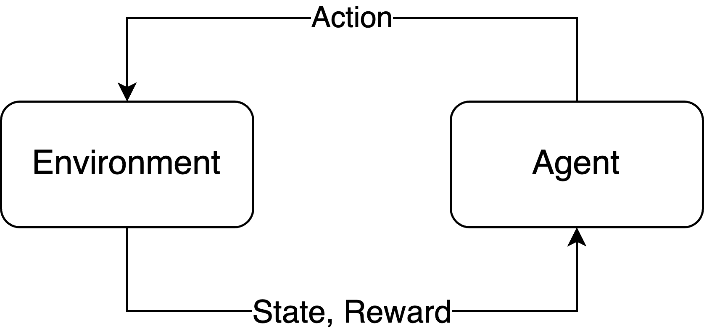
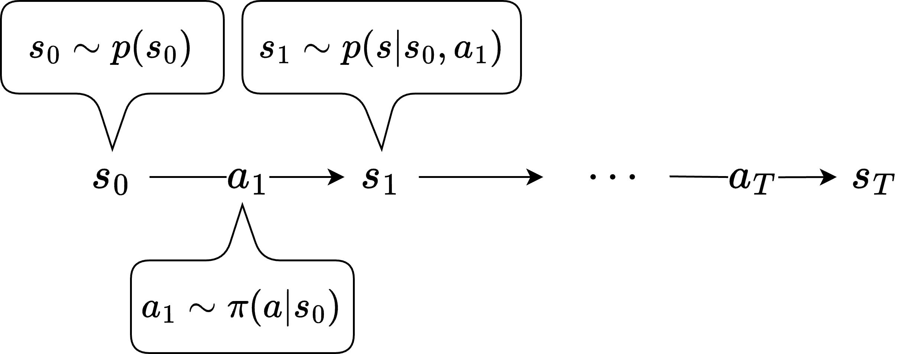

## エージェントと環境の相互作用

強化学習(Reinforcement Learning; RL)はエージェント(Agent)と呼ばれるシステムがゲームや現実世界のような外部環境(Environment)に対して、行動(Action)で働きかけたことで得られる意思決定の良さである報酬(Reward)をできるだけ大きくするようシステム自身を更新するパラダイムだ。

エージェントは環境の状態(State)を受け、行動を選択する主体だ。行動を選択する確率を方策(Policy)と呼ぶ。これはビデオゲームプレイで言えばプレイヤーに相当し、この例で言えば環境はゲーム、行動はボタン操作、報酬はスコアということになる。

## エピソード

一連のエージェントと環境の相互作用をエピソードと呼ぶ。1エピソードの具体的な流れはこうだ:

1. 初期状態のサンプリング: 環境で決められた確率にしたがって初期状態を決める。ゲームのリセット。
2. 行動のサンプリング：（初期）状態から方策 \(\pi\)で行動を決める
3. 状態遷移: 行動で状態遷移が起こる
4. 行動サンプリングと状態遷移を繰り返し、最終時刻 \(T\) まで進める

下の添え字は時刻をあらわしている。省略されているがエピソードを通じて各時刻にエージェントは報酬を受け取っており、それを総和した累積報酬(Return)の期待値を最大化する方策を見つけるのがRLの目的だ。方策が機械学習モデルで実装される場合、エピソードのデータを集めて方策のパラメーターを更新することになる。つまり、エピソード収集＝探索と学習を繰り返すことで方策のパラメーターをより良くしていく。

また、エピソードの構造を規定するのにマルコフ過程(Markov Decision Process; MDP)がよく使われ、状態 \( s_t \), 行動集合 \( a_t \), 状態遷移 \( p(s_{t+1} \mid s_t, a_t) \), 報酬を計算する関数 \( R(s, a)\)、割引率 \(\gamma\) を使って説明される。割引率はエピソードの長さが無限大である場合に都合が悪くなるので導入されるハイパーパラメータで、将来の報酬をどの程度重要視するかを意味している。

## バリエーション

実際にはここまでの定義にはバリエーションがある。方策や状態遷移は一般には確率モデルだが、決定論的であることもある。拡張として、エージェントは状態を部分的にしか知り得ないという設定がある。ゲームの例で言えば、プレイヤーが知りうるのはゲーム画面だったり自分の手札で、ゲームの内部の状態や相手の手札は知り得ない。このような場合は部分観測マルコフ過程(Partially Observable MDP; POMDP)という。POMDPでは状態 \( s_t \) からマスキングなどの何かしらの関数を通してエージェントが知り得る観測（Observation）が加わる。また、エージェントが複数存在する場合もある。多人数ゲームはその典型的な例だろう。複数エージェントはマルチエージェント強化学習（Multi Agent RL）と呼ばれたりする。

基本的にはエージェントは環境の状態遷移と報酬関数に関して無知だが、状態遷移を別途モデリングする場合はモデルベース強化学習という。報酬関数をモデリングする場合は逆強化学習(Inverse RL; IRL)という。IRLは主に過去のエピソードから報酬関数を見つけ出すことで、効率的な探索を目指す。

## 現実的な問題へ適用するときの問題点

様々な問題をRLとして捉えることができるが、現実的な問題として捉えるには様々な壁がある。たとえば、環境を現実世界にした場合に、エピソードのデータを集めることは大きなコストになる。よく指摘されるのはロボットのエージェントが試行錯誤するときに物を壊したり、データ収集の人的・金銭コストだ。また現実世界の（真の）状態は知り得ないため、本質的にはPOMDPになるが、MDPよりも問題が複雑であり解くのが難しい。そのため物理シミュレーションで代用することが多い（Sim2Real）。ただし、摩擦や柔軟物、流体と構造物の相互作用など物理シミュレーションの精度には限界があり、現実との乖離がおきる。シミュレーションに摂動を加える[Domain Randomization](https://arxiv.org/abs/1703.06907)などが提案されている。

シミュレーションでは初期状態のサンプリング、つまりリセットが簡単にできるが、現実の物理環境やすでに稼働しているシステムの場合は困難か、そもそもできない場合もある。リセットを許さないReset-freeな問題設定を扱った[研究](https://openreview.net/forum?id=IPVSK0j8AO)がされている。

報酬関数の存在も障壁になりうる。報酬関数を実装するためには環境の振る舞いを把握できる必要があるし、エージェントの振る舞いの良さを適切に評価する方法は事前に存在することは稀だ。しかもRLの学習は報酬関数の設計にとても依存する性質をもつため、シミュレーション環境下でも入念な設計が必要な場合がある。対して、エピソード終了時に想定したタスクが達成できたか、失敗したかの\(1, -1\)で与えれば報酬関数の実装は比較的簡易になるが、この場合には成功が難しいタスクの場合や、1つのエピソードが長い場合にどの状態における行動が良かったのかを決める（Credit Assignmentと呼ばれる）のが難しい。

## 関連分野

ロボティクスは自律的な行動決定という観点でRLと密接な関わりがある。PID制御のようなシンプルなシステムでも、状態遷移が既知で、目的とする状態（たとえば姿勢）との近さを報酬としたRLとみなすことができる。実際にRLを使ってロボットの巧みな制御を目指す研究は数多くある。

マルチエージェント強化学習では主に経済学やゲーム理論との関連性がある。つまり複数のエージェントが協調したり、あるいは互いに搾取したりする振る舞いをRLのシステムとみなせる。ゲーム理論は特に[Evolutionary Game Theory](https://jair.org/index.php/jair/article/view/10952)と[Neural Replicator Dynamics](https://arxiv.org/abs/1906.00190)を通してマルチエージェント強化学習へとつながる。[Counterfactual Regret Minimization](https://dl.acm.org/doi/10.5555/2981562.2981779)などで出てくるRegretはRLにおけるAdvantageと対応している。

脳の計算論的モデルにもRLは密接な関わりがある。つまり脳は環境である世界を身体を通じて探索し、自らの振る舞いを変える学習をするエージェントとみなせる。モデルベース強化学習である[World Models](https://arxiv.org/abs/1803.10122)は脳の認知的な側面を再現するモデルであると言える。また、探索における意思決定は好奇心や脳の行動原理と関連があり、[自由エネルギー原理との関連](https://arxiv.org/abs/2009.01791)が議論されている。

学習における近似という意味ではベイズ統計がRLのツールとしてよく使われる。[MCMC](https://ja.wikipedia.org/wiki/%E3%83%9E%E3%83%AB%E3%82%B3%E3%83%95%E9%80%A3%E9%8E%96%E3%83%A2%E3%83%B3%E3%83%86%E3%82%AB%E3%83%AB%E6%B3%95)における分散低減のテクニックは似たものがRLにも登場する。

探索を通じた最適化という観点では、[進化戦略](https://ja.wikipedia.org/wiki/%E9%80%B2%E5%8C%96%E6%88%A6%E7%95%A5)とも深い関わりがある。エージェントを個体とみなすことはもちろん、モデルベースRLにおいて未来の状態予測を用いて[Model Predictive Controlを行う](https://arxiv.org/abs/2310.16828)手法は、進化戦略的なヒューリスティックと位置づけることができる。

また、方策として拡散過程モデルを採用する[試み](https://arxiv.org/abs/2205.09991)も行われている。拡散過程モデルの特徴として、サンプリング時に微分可能な評価器を用いて生成軌道をガイド（Classifier guidance）できるという点が挙げられる。これを活用して、より良い行動を[生成する試み](https://arxiv.org/abs/2502.07202)が報告されている。さらに、拡散過程における未来状態の一部時刻を確定せず、不確実なまま推論する[手法](https://arxiv.org/abs/2407.01392)などの研究も進められている。