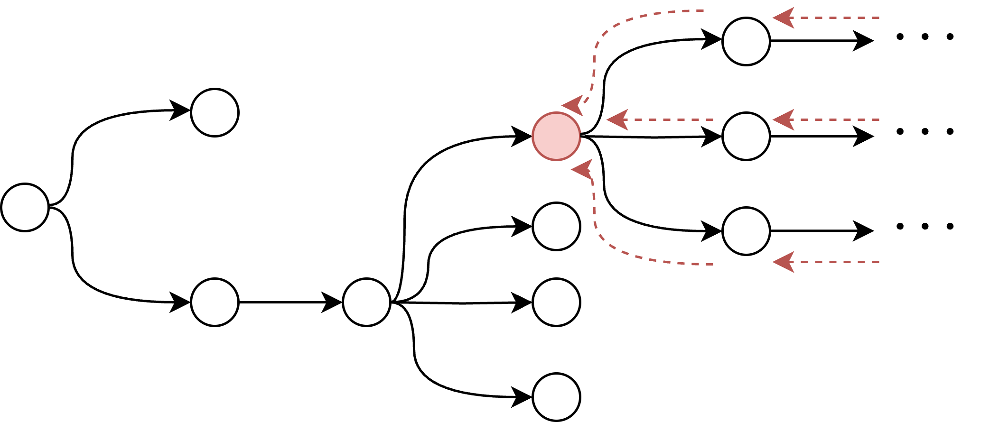

## 価値

価値 (Value) は強化学習 (RL) において重要な概念である。エージェントは環境と相互作用し、状態 \(s_t\) を観測して行動 \(a_t\) を選択し、その結果として報酬 \(r_t\) を受け取る。価値とは、ある状態や状態–行動の組から、将来得られる「累積報酬（return）」の期待値を表す。

具体的には、ある状態 \( s_t \) における**状態価値** \( V(s_t) \) は

\[
V(s_t) = \mathbb{E}[G_t|s_t],
\]

で定義される。ここで \( G_t = \sum_{k=t}^{T-1} r_{k+1} \) は時刻 \(t\) からエピソード終了（時刻 \(T\)）までの報酬の総和（累積報酬）である。文脈によっては「収益」「エピソード報酬和」「利得」などと呼ばれることもある。

同様に、ある状態 \( s_t \) で行動 \( a_t \) を選んだ場合の**状態行動価値**（行動価値、\(Q\) 値）\( Q(s_t, a_t) \) は

\[
Q(s_t, a_t) = \mathbb{E}[G_t|s_t, a_t]
\]

と表される。ここで期待値 \(\mathbb{E}\) は、その後の状態や行動の確率分布を考慮したものである。

下図（概念図）では、丸印が状態を表し、矢印は行動を選択して次の状態へ進む様子を示している。赤い丸印から下の木全体を考え、その全体の報酬期待値をとったものが状態価値 \( V(s_t) \) であり、ある矢印（行動）を固定して見たとき、その先で得られる報酬期待値が行動価値 \( Q(s_t, a_t) \) となる。

## 価値と方策の近似

状態数や行動数が有限で十分に少ない場合を除き、価値を厳密に計算するのは困難である。このため、エージェントは方策に従って環境と相互作用し、得られたエピソード（サンプル）から価値を推定する必要がある。状態や行動が離散であれば表で管理できるが、組合せが非常に多い場合はメモリが不足する。こうした場合、ベイズ的手法や遺伝的アルゴリズムなどのパラメトリック手法が研究されてきた。とくに近年は深層学習による近似が盛んであり、深層強化学習 (Deep Reinforcement Learning, DRL) とも呼ばれる。

シンプルな方法としてはモンテカルロ法的に、実際に得られた報酬和を近似値にしていまうという方法だ。これはかなり大雑把に見えるかもしれないが、バイアスが少ないため便利だ。実際に得られるデータが少ない現実的な設定では割と使われている。パラメーター \( \phi \) をもつ価値近似ニューラルネットワーク \( V(s_t;\phi) \) の損失 \( L(\phi) \) を二乗誤差を使って以下のように計算する。

$$
L(\phi) = || g(s_t) - V(s_t; \phi) ||_2
$$

\( g(s_t) \) は \( s_t \) から実際に得られた未来の報酬和をあらわす。

ある時刻の価値は「1ステップ先の価値＋現在の報酬」として再帰的に表せることを利用して動的計画法的に誤差を更新する方法がTD（Temporal Difference）法である。たとえば状態価値に対しては、

\[
L(\phi) = ||r_{t+1} + V(s_{t+1}; \phi) - V(s_t; \phi) ||_2
\]

のような二乗誤差を用いてパラメータ \(\phi\) を更新する。状態価値 \( V \) の近似を説明してきたが、同様に行動価値(Q値)についても同じような方法が定義できる。特にTD法で行動価値を推定する手法は State-Action-Reward-State-Action(**SARSA**) と呼ばれる。

## 方策の近似

価値に加え、行動を決定する方策（policy）自体も連続行動空間などでは確率分布として近似が必要になる。離散行動であれば、行動価値 \(Q\) がうまく学習できればそれを最大化する行動を選択するだけで済む場合もある。しかし行動が連続、あるいは確率的方策そのものが必要な場合は、[方策勾配法](https://papers.nips.cc/paper/1713-policy-gradient-methods-for-reinforcement-learning-with-function-approximation.pdf) (Policy Gradient; PG) が利用される。たとえばパラメータ \(\theta\) を持つ方策 \(\pi(a_t | s_t; \theta)\) に対して、モンテカルロ法で簡単に表すなら、

\[
L(\theta) = - \bigl[G_t|s_t\bigr] \log \pi(a_t | s_t; \theta)
\]

を勾配降下で最適化する。ここで \(\bigl[G_t|s_t\bigr]\) として実際にサンプリングされた値 \(g(s_t)\) を用いたアルゴリズムを **REINFORCE** と呼ぶ。

## RLの学習

機械学習を用いた強化学習では、典型的に以下のフェーズを繰り返して学習する：

1. 初期化：方策ネットワークと価値ネットワークのパラメータを初期化
2. 探索：現在の方策に従ってある程度のエピソードを実行してデータを収集
3. 学習：収集したデータを用いてパラメータを更新

強化学習（RL）は、学習データそのものを学習中の方策ネットワークが集める点で、クラス分類などの静的データセット学習と大きく異なる。方策が改善すれば得られる報酬も増え、それがさらに学習を促進する。本質的にRLは探索と学習が両立し互いに支え合うBootstrappingなシステムである。逆に、探索と学習のどちらかが失敗すると共倒れにもなる。これがRLの難しいところだ。

## オンポリシー・オフポリシー

探索と学習は計算コストが高いので並列的に進めたい場合が多く、また行動にノイズを加えてデータの多様性を確保したいことも多い。このような場合、探索に使う方策（Behavior Policy）と学習対象となる方策（Target Policy）が異なる。これを**オフポリシー**(Off-policy)学習と呼び、同一な場合は**オンポリシー**(On-policy)と呼ぶ。一般にオフポリシーは計算効率が高い一方でバイアスが生じやすく、学習に多くのサンプルを要する。対してオンポリシーはバイアスは少ないが学習が遅くなる、といったトレードオフがある。基本的には難しい問題を解くためには大量のデータと大きなニューラルネットワークが必要になるため、オフポリシーで方策ギャップを重点サンプリングなどで[補正](https://arxiv.org/abs/1606.02647v2)するというアプローチが採られることが多い。

オンポリシー学習アルゴリズムとしては先述の SARSA や REINFORCE などがある。一方、オフポリシーな行動価値学習で有名なのは **Q-Learning** である：

\[
L(\phi) = \bigl(r_{t+1} + \max_{a'} Q(s_{t+1}, a'; \phi) - Q(s_t, a_t; \phi)\bigr)^2.
\]

これを深層学習で近似した手法が **Deep Q-Learning (DQN)** だ。これをベースラインとして、探索の分散コンピューティングや、方策ギャップの補正、モデルアーキテクチャ、探索アルゴリズムの改良、損失関数やデータのサンプリングの工夫など様々な改良が加えられており、たとえば [Rainbow](https://arxiv.org/abs/1710.02298) や [Agent57](https://arxiv.org/abs/2003.13350) が提案されている。

オンポリシーとオフポリシーは全く別の手法というよりも、方策ギャップの大きさで地続きになっている関係と捉えた方がよいかもしれない。実際に、オフポリシーであるQ-Learningにおいて、どのくらいの探索の頻度で学習をするかというReplay Ratioが大きな影響を与えることが[知られている](https://arxiv.org/abs/2205.07802)。また、オンポリシーと呼ばれているアルゴリズムでもベースライン実装（[例](https://github.com/DLR-RM/stable-baselines3)）では一定のエピソード長さを探索した後に学習があり、その間隔を調整することで結果が大きく変わる。

## ニューラルネットワークによる近似の課題

価値をスカラーで近似する場合、誤差関数に二乗誤差を用いると分散が大きいときに収束しづらい問題がある。そこで、**価値を確率分布として扱う手法**が考案されている。たとえば [D51](https://arxiv.org/abs/1707.06887) は価値のとりうる範囲を一定間隔に区分して、その区分インデックスをクラスとみなしたカテゴリカル分布として学習する。これだと値の範囲を事前に把握する必要があり、分割範囲の細かさを値のレンジごとに指定するのが大変なため、[分位点推定を使う手法](https://arxiv.org/abs/1806.06923)（およびその[拡張](https://arxiv.org/abs/1911.02140)）も提案されている。さらに最近は、価値を分布で扱うことでスケーラビリティが改善するとの[報告もある](https://arxiv.org/abs/2403.03950)。

また、ニューラルネットワークは強力な近似モデルだが、継続的な学習との相性で課題も多い。学習初期のデータに偏って過学習する [Primacy Bias](https://arxiv.org/abs/2205.07802)や、新しい知識の習得が進むにつれ学習できなくなる **可塑性の喪失（Loss of Plasticity）** が知られている。対策としては、重みをスケーリングしつつ摂動を加えて未学習の表現領域を残す [Shrink and Perturb](https://arxiv.org/abs/1910.08475)、あるいは Adam Optimizer の勾配移動平均を[調整する手法](http://arxiv.org/abs/2303.01486) などが提案されている。また、学習後の重み行列を調べると休眠ニューロン（[Dormant Neuron](https://arxiv.org/abs/2302.12902)）が増える傾向があり、これを選択的にリセットする [Continual Back Propagation](https://www.nature.com/articles/s41586-024-07711-7) などの手法も検討されている。しかしこれらはニューラルネットワークのアーキテクチャに依存し、まだ発展途上の研究領域である。